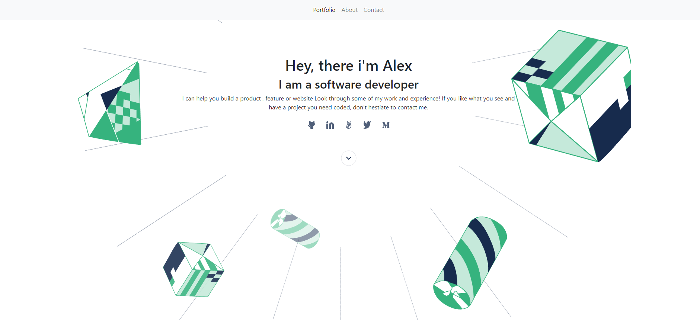

# Portfolio

> This an implementation of a portfolio using bootstrap 5.

## Built With

- HTML
- CSS
- VSCode

## Authors

👤 **Mirouhml**

- GitHub: [@mirouhml](https://github.com/mirouhml)
- LinkedIn: [LinkedIn](https://www.linkedin.com/in/ammar-hamlaoui-514909189/)
- Twitter: [@kuronomirou](https://twitter.com/kuronomirou)

👤 **Alexander Oguzie-Ibeh** 

- GitHub: [github](https://github.com/harlexkhal)
- LinkedIn: [linkedin](https://www.linkedin.com/in/alexander-oguzie-ibeh-776814164)
- Twitter: [twitter](https://twitter.com/harlexkhal)

## 🤝 Contributing

Contributions, issues, and feature requests are welcome!

Feel free to check the [issues page](../../issues/).

## Show your support

Give a ⭐️ if you like this project!

